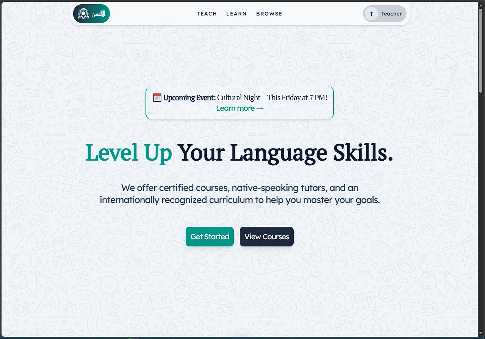
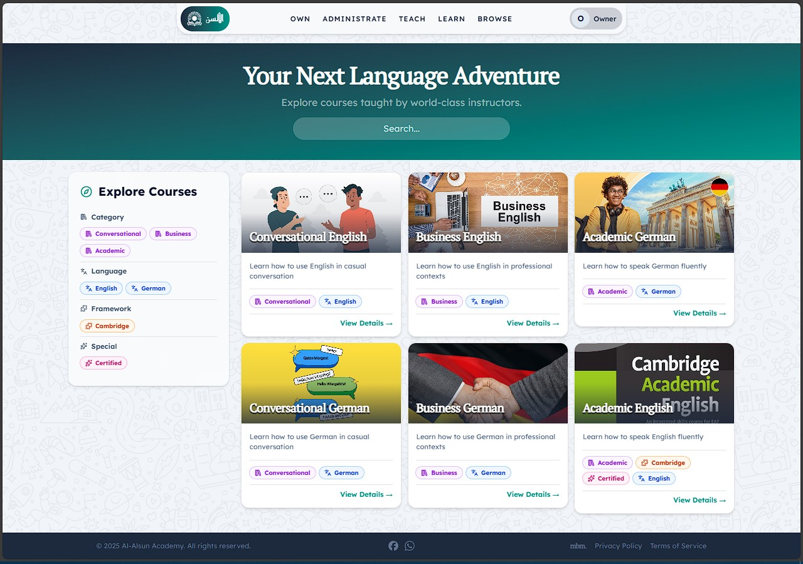
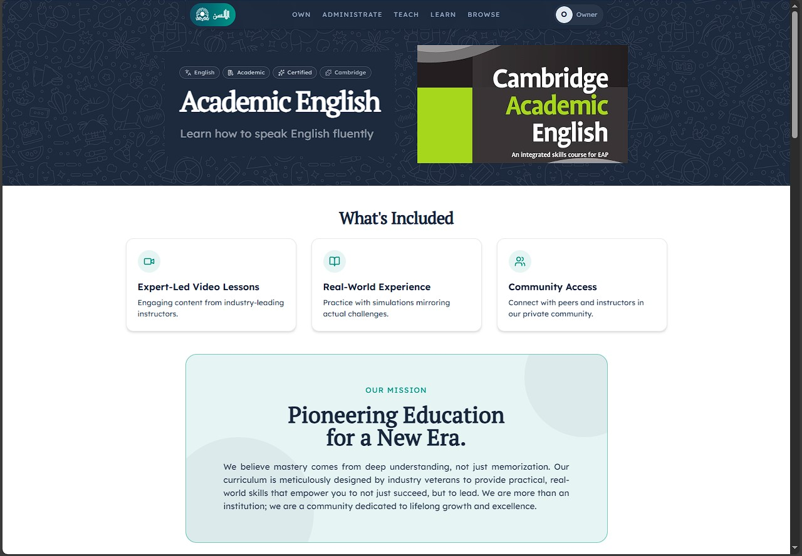
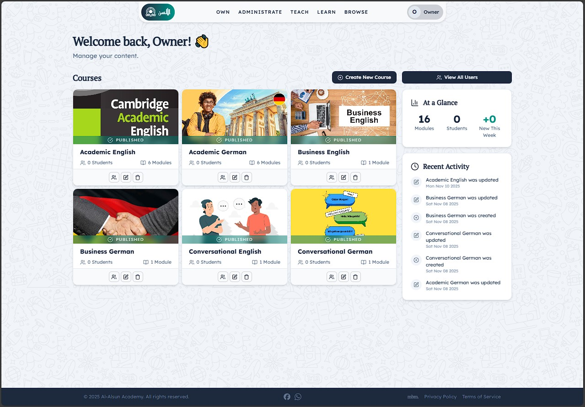
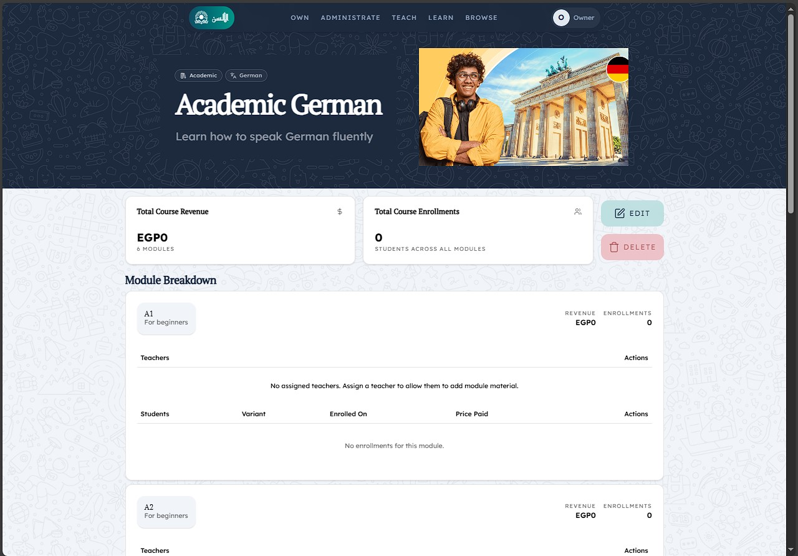
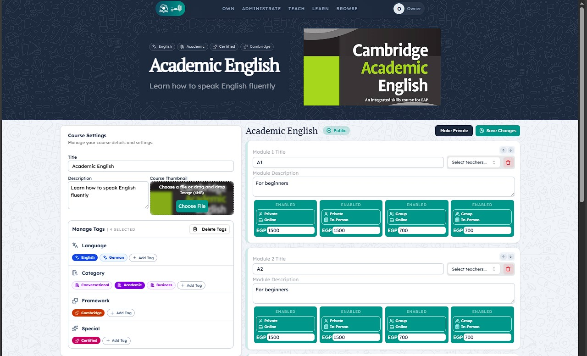

# Project Alsun
> A robust Content Management System (CMS) for managing and selling access to tiered course materials.

Project Alsun provides a platform for administrators and teachers to create structured educational content (Courses → Modules → Variants) and for users to purchase access to the specific material they need. Originally designed for language content, it features a flexible tagging and variant system that can adapt to any form and category of content.

[Demo](https://project-alsun.netlify.app/)





## Key Features

**Hierarchical Content Structure:** Organize content logically:
-  **Courses:** The top-level category (e.g., "Academic English").
-  **Modules:** Specific subjects within a course (e.g., "A1 - Beginners").
-  **Variants:** Different access tiers or versions of a module, each with its own price (e.g., "Private - In Person," "Group - Remote").

**Role-Based Access Control:**
-  **Admins:** Have full control to create courses and assign teachers to modules.
-  **Teachers:** Can add and manage `ModuleContent` for their assigned modules.
-  **Users:** Can sign up, browse, and purchase variants to gain access to specific content.

**Dynamic Content Access:** Content visibility is tied to the purchased variant, ensuring users only see what they paid for.

**User Management:** Sign-up and authentication flow for students, multi-role access control for staff.

**File Uploads:** Integrated with **UploadThing** for file management.

##  Tech Stack

This project is built with a modern, type-safe, and scalable technology stack:

-  **Framework:** [Next.js](https://nextjs.org/)
-  **Language:** [TypeScript](https://www.typescriptlang.org/)
-  **UI Library:** [React](https://reactjs.org/)
-  **Styling:** [Tailwind CSS](https://tailwindcss.com/)
-  **Database ORM:** [Prisma](https://www.prisma.io/)
-  **Database:** [PostgreSQL](https://www.postgresql.org/) (hosted on [Supabase](https://supabase.com/))
-  **Authentication:** [better-auth](https://www.better-auth.com/)
-  **File Uploads:** [UploadThing](https://uploadthing.com/)
-  **Deployment:** [Netlify](https://www.netlify.com/)

## Getting Started

Follow these instructions to get a local copy of the project up and running.

1.  **Set .env:**
Rename the  `.env.example` file to `.env` and add your database connection string, `better-auth` secret and `uploadthing` key. Most importantly, set your `DATABASE_URL` and create a secure `MASTER_PASSWORD`.

2.  **Generate Prisma Client:**

This command reads your `schema.prisma` file, sets up the structure in your database, and generates the TypeScript types for your database models,

```sh
npx prisma migrate dev
```

## Becoming an Owner

After starting the application for the first time, you need to create an "Owner" account to get full administrative permissions.

1. Navigate to the application and create a regular user account through the sign-up page.

2. Once you are logged in, navigate to the `/own` page (e.g., `http://localhost:3000/own`).

3. Enter the `MASTER_PASSWORD` that you set in your `.env` file.

Upon successful submission, your account will be granted full owner privileges, allowing you to create courses, manage modules, assign staff, and more.



